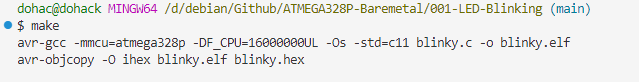
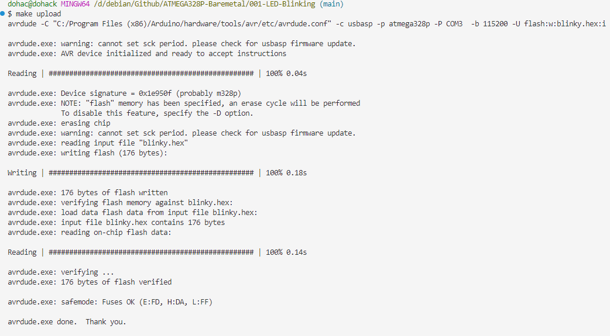
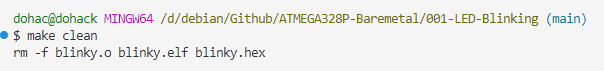

# ATMEGA328P-Baremetal

This repository contains a simple baremetal project for the ATMEGA328P microcontroller. The provided example demonstrates how to blink an LED every 100 milliseconds using the AVR-GCC toolchain. The project is configured with a custom Makefile to handle compilation, linking, building, uploading, and cleaning.

## Project Structure

```
.
├── blinky.c
├── Makefile
├─ Readme.md
```

- **blinky.c**: Source code for blinking an LED.
- **Makefile**: Custom Makefile for building and uploading the project.
- **Readme.md**: This file.
- **make-clean.PNG**: Screenshot showing the `make clean` command in action.
- **make.PNG**: Screenshot showing the `make` command in action.
- **make-upload.PNG**: Screenshot showing the `make upload` command in action.

## Prerequisites

- **AVR-GCC** toolchain: Includes `avr-gcc`, `avr-objcopy`, and `avrdude`.
- **AVRDUDE**: For uploading the compiled code to the microcontroller.
- **usbasp**: Programmer for the ATMEGA328P (or adjust the `PROGRAMMER` in the Makefile if using a different programmer).

## Getting Started

1. **Clone the Repository**

   ```bash
   git clone https://github.com/your-username/ATMEGA328P-Baremetal.git
   cd ATMEGA328P-Baremetal
   ```

2. **Build the Project**

   Run the following command to compile the code, link, and create the HEX file:

   ```bash
   make
   ```

   This will generate `blinky.hex`, which is ready to be uploaded to the microcontroller. See the screenshot below for the output of this command:

   

3. **Upload the HEX File**

   To upload the compiled code to the ATMEGA328P, use:

   ```bash
   make upload
   ```

   Ensure that the `PORT` and `PROGRAMMER` variables in the Makefile are correctly set for your system. The screenshot below shows the `make upload` command in action:

   

4. **Clean Build Files**

   To clean up the generated files, use:

   ```bash
   make clean
   ```

   This command removes the object files, ELF, and HEX files. Below is a screenshot of the `make clean` command:

   


## Troubleshooting

- **Compilation Issues**: Ensure that `avr-gcc` is correctly installed and available in your system's PATH.
- **Uploading Issues**: Verify the `AVRDUDE_CONF` path and `PORT` settings in the Makefile. You might need to adjust them based on your specific setup and operating system.

## License

This project is licensed under the MIT License. See the [LICENSE](LICENSE) file for details.

---

Feel free to adjust any specific details according to your needs!